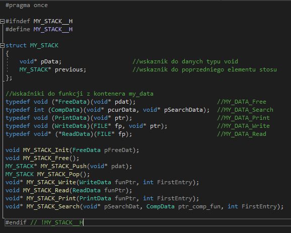
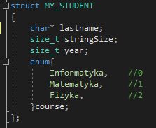

# Stack implementation using void pointers

The project is about handling the stack. Stack handling is data type independent
as it relies on the use of void pointers. The functions that are available to
the user are: adding a new element (push), removing an element (pop), releasing
the stack (clear), displaying all stack elements (print stack), writing to a
binary file, reading from a binary file, searching the stack and terminating
program (finish).

The structure used in the project is MY_STUDENT contains the student's name
(*char), year of birth(size_t) and field of study(enum).

